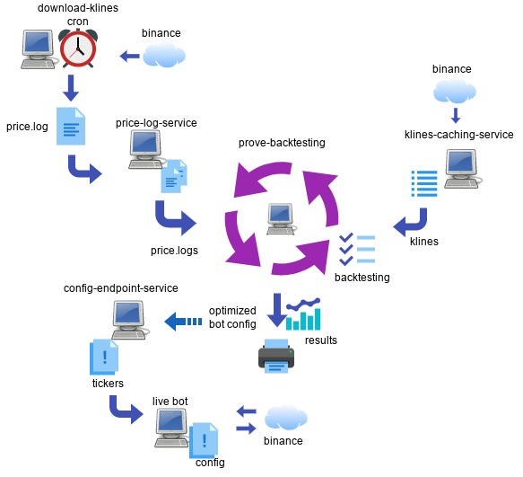

# CryptoBot - Binance Trading Bot

A python based trading bot for Binance, which relies heavily on backtesting.



 1. [Overview](#overview)
 2. [History](#history)
    * [How does it work](#how-does-it-work)
 3. [Discord](#discord)
 4. [Getting started](#getting-started)
 5. [Usage](#usage)
 6. [Automated Backtesting](#automated-backtesting)
 7. [Prove automated-backtesting results](#prove-automated-backtesting-results)
 8. [config-endpoint-service](#config-endpoint-service)
 9. [Control Flags](#control-flags)
10. [Config settings](#config-settings)
    * [PAIRING](#pairing)
    * [INITIAL_INVESTMENT](#initial_investment)
    * [RE_INVEST_PERCENTAGE](#re_invest_percentage)
    * [PAUSE_FOR](#pause_for)
    * [STRATEGY](#strategy)
      * [BuyMoonSellRecoveryStrategy](#buymoonsellrecoverystrategy)
      * [BuyDropSellRecoveryStrategy](#buydropsellrecoverystrategy)
      * [BuyOnGrowthTrendAfterDropStrategy](#buyongrowthtrendafterdropstrategy)
      * [RSA/EMA](#rsa/ema)
    * [BUY_AT_PERCENTAGE](#buy_at_percentage)
    * [SELL_AT_PERCENTAGE](#sell_at_percentage)
    * [STOP_LOSS_AT_PERCENTAGE](#stop_loss_at_percentage)
    * [TRAIL_TARGET_SELL_PERCENTAGE](#trail_target_sell_percentage)
    * [TRAIL_RECOVERY_PERCENTAGE](#trail_recovery_percentage)
    * [HARD_LIMIT_HOLDING_TIME](#hard_limit_holding_time)
    * [SOFT_LIMIT_HOLDING_TIME](#soft_limit_holding_time)
    * [KLINES_TREND_PERIOD](#klines_trend_period)
    * [KLINES_SLICE_PERCENTAGE_CHANGE](#klines_slice_percentage_change)
    * [CLEAR_COIN_STATS_AT_BOOT](#clear_coin_stats_at_boot)
    * [NAUGHTY_TIMEOUT](#naughty_timeout)
    * [CLEAR_COIN_STATS_AT_SALE](#clear_coin_stats_at_sale)
    * [SELL_AS_SOON_AS_IT_DROPS](#sell_as_soon_as_it_drops)
    * [DEBUG](#debug)
    * [MAX_COINS](#max_coins)
    * [TICKERS](#tickers)
    * [TRADING_FEE](#trading_fee)
    * [PRICE_LOGS](#price_logs)
    * [ENABLE_PUMP_AND_DUMP_CHECKS](#enable_pump_and_dump_checks)
    * [ENABLE_NEW_LISTING_CHECKS](#enable_new_listing_checks)
    * [ENABLE_NEW_LISTING_CHECKS_AGE_IN_DAYS](#enable_new_listing_checks_age_in_days)
    * [STOP_BOT_ON_LOSS](#stop_bot_on_loss)
    * [ORDER_TYPE](#order_type)
    * [PULL_CONFIG_ADDRESS](#pull_config_address)
    * [PRICE_LOG_SERVICE_URL](#price_log_service_url)
    * [KLINES_CACHING_SERVICE_URL](#klines_caching_service_url)
    * [CONCURRENCY](#concurrency)
    * [SORT_BY](#sort_by)
      * [max_profit_on_clean_wins](#max_profit_on_clean_wins)
      * [number_of_clean_wins](#number_of_clean_wins)
      * [greed](#greed)
11. [Bot command center](#bot-command-center)
12. [Development/New features](#development/new-features)

## Overview

CryptoBot is a python based bot which relies heavily on automation and
backtesting to work across different trends of the market.

## History

I built this bot due to my own negative experience in other opensource bots that
lacked backtesting support and which had farly convoluted codebases, with no
tests making them hard to extend or modify with the features I wanted.

Essentially, I was looking for a bot where I could consume binance data and run
backtesting using different strategies. My initial goal was for a
bot that would buy a particular coin when that coin price went down by x% and
then sell it when the coin price raised by %y.

I added new functionality as I felt I need it, for example the bot started
by using a mode *logmode* which would save the current price for all the coins
with a 1s or less granularity. By having prices logged over a number of days I
could run backtesting strategies and identify the best options over the past days
in detail.
As the time to backtest increased with the number of logs, I added options to
consume price information from the logs every N seconds. For example only
consuming the price records entries price records every 60 seconds or so.
This allowed me to have a quick glance of how a particular backtesting strategy
would behave on a number of available price logs for the last N days.
I could then pick the best strategy and reduce the interval back to 1 second to
understand how that strategy would behave in a *normal* trade day.

Several rounds of refactoring and profiling the code improved the execution time,
down from minutes to around 30 seconds per daily log.

As saving daily logs through the *logmode* forced to have to run the bot for a
number of days before I could get any useful data to backtest, I looked into
automating the download of klines from binance using the minimum 1min interval
and saving them into the price log format consumed by the bot.
With this new tool I could now download price log files going back until 2017 from
binance and run backtesting since the beggining of time.

At this point, backtesting was time consuming and tricky to identify the best
crypto tokens to backtest as well as what parameters to apply to each one
of those tokens. A mix of luck, looking at market charts and identifying
patterns allowed me to fit a set of parameters onto a coin and backtesting it
so that the bot would return a sane profit. And as long the market conditions
remained the same, the bot would return a profit while trading in live mode.

Might be worth pointing out now, that the bot has a few modes of operation,
backtesting, live, testnet, logmode.

At this point I started looking on how I could automate the tasks of finding
the best options for each coin over a period of time.
This lead me to simply automate the same tasks I was running manually which were to
run backtesting multiple times with different parameters and log those returns.
Eventually I added code to strip out any coins that didn't provide a minimum
amount of profit and filtering the best configs for each
one of those tokens automatically, ending with a single optimized config for a
number of crypto tokens.

As I had access to a good chunk of CPU, I refactored the automated backtesting
code to consume all my available CPU cores.
This of course caused the run to start hitting binance API limits.
To avoid those I started added proxies, retrying API calls to binance to avoid
hitting those rate limits and failed backtesting sessions.
For example when the bot finds a coin for the first time in a price log, it
would call binance to retrieve all its klines data from the last 60 min on a
1min interval, last 24 hours on a 1h interval and the last 1000 days on a daily
interval. Additionally for every trade I needed to find the precision to use for
each token. All this data needed to be saved locally as I would be requesting it
multiple times over and over. This new service klines-caching-service that would
deal with interacting with binance for me.

With access to enough CPU and a set of good strategies, I could achieve results
where I would invest $100 in 2017 and the bot would return in an optimized
config just above a million.
Of course this is not representative of how well the bot would behave in live
and that for the amounts involved there would never be enough liquidity in the
market. So I would always took these results with a very large grain of salt.

This lead me to another question, on how could I improve my confidence on the
results provided by these automated backtesting runs ?

I thought of a couple of things, first I would discard any coins on a particular
run that finished the runs with a stop-loss or a stale, or sill holding that
coin in the wallet at the end of the run. And focus the results on getting the
config for a coin that returned not the maximum profit but the highest number of
trades without any losses. This essentially meant that the bot instead of buying
a coin when it dropped in price by 10%, it would instead buy that coin when it
dropped in price by 40%.
This resulted in some side optimizations in backtesting, for example I would
quit backtesting a coin early as soon as I hit a STALE or a STOP LOSS.

The remaining piece was to automate the automated backtesting, instead of
running the backtesting over the last 300 days or so. I refactored the
automated backtesting script into pretending that we were running in live mode.
Essentially I would give a start date, like 2021-01-01 tell the bot to backtest
300 days and then run in pretend *live* mode for 30 days, before repeating this
process from the 2021-02-01 all the end until 2022-12-31.
The feedback was that I could see how a particular set of strategies would
behave in different markets and how well the automated-backtesting would adapt
to those changing markets. Essentially I could simulate what the bot looked to
return in a live scenario by using backtesting data against new price logs that
hadn't been backtested yet.

I could now identify strategies that could return lower consistent returns
insted of higher profits in highly volatile runs that would trigger my anxiety
response if I were to be trading that strategy live.

I called this new automated-backtesting, prove-backtesting.

Around this time I added a new price log service that would serve the price
logs to the backtesting bots. This resulted in removing all the IO I was
experiencing while running 48-96 concurrent bots and saved my SSDs from total
destruction. As part of the donwload klines script, I optimized the download of
klines so that I could have daily price log files for each coin.
This would allow the bot to backtesting a single coin in under a second, even
for a large number of price log files.

As of today, I can backtest around 300 days of logs for 48-96 coins in just a
few seconds on an old dual Xeon for those less permisive configs.

Possibly the final piece was how to collect the optimized backtesting configs I got
from my prove or automated-backtesting runs and feed them to my live bots.
For this I updated the bot to poll a http endpoint for a new set of configs and refresh
itself as soon a new config was available.
I called this the config-endpoint-service, and essentially its a service that
runs a prove-backtesting session (nightly or so) and when it finishes makes that
optimized config available to the live bot on a http endpoint.

With all these changes the original bot is now a collection of services
and is mostly hands-free.


# What tools

So what tools do we have?

There are multiple tool or services in this repo, for example:

* Downloading old klines price log files
* Automating backtesting multiple strategies against a number of kline
    *price.logs*, and producing an optimized strategy to use going forward.
* Reviewing how well our strategy works over a backtested period by re-running
  an automated-backtesting over and over a rolling-window, for example all the
  way back from 2017 to today, simulating a real live scenario.
* A caching proxy for binance klines calls, during automated-backtesting
    sessions, the bot can easily hammer the binance Api and be blocked due to
    rate limits. This caching proxy, keeps track of the number of requests/min
    avoiding going over the Binance Api rate limits.
* A config service, which listens on a particular http port and runs
    automated-backtesting periodically or on-demand, providing the tuned config
    through HTTP. The bot can be configured to replace its existing config with
    the provided by this service as soon as it becomes available. We can for
    example trigger a run of the automated-backtesting just after 00:00 and the
    bot will then consume a config that is optimized up to the last few minutes.
* A price_log http server, this can be used to serve price.log files from a
    central location to the different backtesting runners.

### How does it work

This bot looks to buy coins that at have gone down in price recently and are
now recovering from that downtrend. It relies on us specifying different
buy and sell points for each coin individually. For example, we can tell the
bot to buy BTCUSDT when the price drops by at least 6% and recovers by 1%. And
then set it to sell when the price increases by another 2%.
Or we may choose trade differently with another more volatile coin
where we buy the coin when the price drops by 25%, wait for it to recover by 2%
and then sell it at 5% profit.

In order to understand what are the best percentages on when to buy and sell for
each one of the coins available in binance, we use backtesting strategies
against a number of logfiles containing dated coin prices. Let's call them
klines price.logs.
These *price.logs* can be downloaded in 1 min interval klines from binance using a
[tool available in this repository](#obtaining-old-price-log-files).

With these price.log files we can run the bot in *backtesting* mode
which would run our buy/sell strategy against those price.log files and simulate
what sort of returns we would get from a particular strategy and a time frame
of the market.

In order to help us identify the best buy/sell percentages for each coin, there
is a helper tool in this repo which runs a form of
[automated-backtesting](#prove-backtesting) against
all the coins in binance and a number of buy/sell percentages and strategies
and returns the best config for each one of those coins for a specific period in
time.
This tool can be used to verify how a strategy behaves across changing markets
conditions and how well the bot adapts to those changes.

The way the bot chooses when to buy is based on a set of strategies which are
defined in the [strategies/](./strategies/) folder in this repo.
You can choose to build your own strategy and place it on the
[strategies/](./strategies) folder,

This bot currently provides different strategies:

* [*BuyDropSellRecoveryStrategy*](./strategies/BuyDropSellRecoveryStrategy.py)
* [*BuyMoonSellRecoveryStrategy*](./strategies/BuyMoonSellRecoveryStrategy.py)
* [*BuyOnGrowthTrendAfterDropStrategy*](./strategies/BuyOnGrowthTrendAfterDropStrategy.py)
* [*BuyOnRecoveryAfterDropDuringGrowthTrendStrategy*](./strategies/BuyOnRecoveryAfterDropDuringGrowthTrendStrategy.py)
* [*BuyOnRecoveryAfterDropFromAverageStrategy*](./strategies/BuyOnRecoveryAfterDropDuringGrowthTrendStrategy.py)

The way some of these strategies work is described later in this README. The
others can be found in the strategy files themselves.

While the price for every available coin is recorded in the *price.log*
logfiles, the bot will only act to buy or sell coins for coins listed
specifically on its configuration.

Each coin needs to be added to the configuration with a set of values for when to
buy and sell. This allows us to tell the Bot how it handles different coins
regarding their current state. For example, a high volatile coin that drops 10%
in price is likely to continue dropping further, versus a coin like BTCUSDT that
is relatively stable in price.

With that in mind, we can for example tell the Bot to when this coin drops *x%*
buy it, and when that coin drops *y%* buy it.

We could also let the bot do the opposite, for coins that are going on through
an uptrend, we can tell the bot to as soon a coin increases in value by % over a
period of time, we tell the bot to buy them.

For these different settings we apply to each coin, let's call them profiles for
now. These profile is essentially how the bot makes decisions on which coins to
buy and sell.

So for example for the *BuyDropSellRecoveryStrategy*:

I specify that I want the bot to buy *BTCUSDT* when the price initially drops
by at least 10%, followed by a recovery of at least 1%.

It should then look into selling that coin at a 6% profit upwards,
and that when it reaches 6% profit, the bot will sell the coin when the price
then drops by at least 1%.

To prevent loss, in case something goes wrong in the market.
I set the STOP LOSS at -10% over the price paid for the coin.

To avoid periods of volatility, in case after a stop-loss I set that I don't
want to buy any more BTCUSDT for at least 86400 seconds. After than the bot will
start looking at buying this coin again.

Some coins might be slow recovering from the price we paid, and take some time
for their price to raise all the way to the 6% profit we aim for.

To avoid having a bot coin slot locked forever, we set a kind of TimeToLive
on the coins the bot buys. We call this limit *HARD_LIMIT_HOLDING_TIME*.
The bot will forcefully sell the coin regardless of its price when this period expires.

To improve the chances of selling a coin during a slow recovery, we decrease
the target profit percentage gradually until we reach that *HARD_LIMIT_HOLDING_TIME*.

This is done through the setting *SOFT_LIMIT_HOLDING_TIME*, with this
setting we set the number of seconds to wait before the bot starts decreasing
the profit target percentage. Essentially we reduce the target profit until it
meets the current price of the coin.

Below in an example of a *profile* for BTCUSDT,

```yaml
TICKERS:
  BTCUSDT:
      SOFT_LIMIT_HOLDING_TIME: 3600
      HARD_LIMIT_HOLDING_TIME: 7200
      BUY_AT_PERCENTAGE: -10.0
      SELL_AT_PERCENTAGE: +6
      STOP_LOSS_AT_PERCENTAGE: -10
      TRAIL_TARGET_SELL_PERCENTAGE: -1.0
      TRAIL_RECOVERY_PERCENTAGE: +1.0
      NAUGHTY_TIMEOUT: 604800
      KLINES_TREND_PERIOD: 0d # unused in this strategy
      KLINES_SLICE_PERCENTAGE_CHANGE: +0 # unused in this strategy
```

In order to test the different 'profiles' for different coins, we would then
run this bot in backtesting mode.

There are 4 modes of execution: logmode, live, testnet, backtesting

## Discord

If you need help, bring snacks and pop over at:

Join on: <https://discord.gg/MaMP3gVBdk>

DO NOT USE GitHub issues to ask for help. I have no time for you. You'll be told off.

Also: *NO TORIES, NO BREXITERS, NO WINDOWS USERS, NO TWATS*, this is not negotiable.

## Getting started

If you don't know Python you might be better using an
[Online Crypto Trading Bot](https://duckduckgo.com/?q=online+crypto+trading+bot&ia=web) instead.

Or get your hands dirty by,

1. Learn Python <https://www.learnpython.org/>

2. Learn Docker <https://learndocker.online/>

3. Learn Git <https://www.w3schools.com/git/default.asp>

## Usage

1. Install docker as per <https://docs.docker.com/get-docker/>

2. Clone this repository:

```console
git clone https://github.com/Azulinho/cryptobot.git
```

4. generate a *config.yaml*, see the example configs in the
[examples](https://github.com/Azulinho/cryptobot/tree/master/examples) folder.

Or the configs used for tests in the
[tests](https://github.com/Azulinho/cryptobot/tree/master/tests) folder

Place your new *my_newly_named_config.yaml* file into the *configs/* folder.

5. Add your Binance credentials to */secrets/binance.prod.yaml*.
   See the [example
   secrets.yaml](https://github.com/Azulinho/cryptobot/blob/master/examples/secrets.yaml) file

Note that you don't need valid credentials for backtesting, or logmode.

```yaml
ACCESS_KEY: "ACCESS_KEY"
SECRET_KEY: "SECRET_KEY"
```

6. When running the bot for the first time, you'll need to obtain some
   *price.log* files for backtesting.

```console
./run download-price-logs FROM=20210101 TO=20211231
```

  And wait, as this will take a while to run.
  If it fails, you can restart it from the day that failed.

  All logs will be downloaded to the logs/ directory.

7. Run a local price-log server to serve the downloaded price log files

```console
./run price_log_service BIND=0.0.0.0 PORT=8998
```

8. Run a local klines-caching server

```console
./run klines-caching-service BIND=0.0.0.0 PORT=8999
```

9. Update your config.yaml file and include the dates we are using for
our backtesting.

```yaml
PRICE_LOGS:
 - "log/20210101.log.gz"
 - "log/20210102.log.gz"
 - "log/20210103.log.gz"
 - "log/20210104.log.gz"
 - "log/20210105.log.gz"
```

Also update the urls for the PRICE_LOG_SERVICE_URL, KLINES_CACHING_SERVICE_URL.

Examples as per the *./run* commands above:

```yaml
PRICE_LOG_SERVICE_URL: "http://< insert my ip here >:8998"
KLINES_CACHING_SERVICE_URL: "http://< insert my ip here >:8999"
```

10. run the bot in backtesting mode, which will perform simulated buys/sells on
all collected price logs based on the provided config.yaml.

```console
./run backtesting CONFIG_FILE=config.yaml
```

11. Update your config.yaml until you are happy with the results and re-run the
   backtesting.

   Some pointers:

   if your coins hit *STOP LOSS*, adjust the following:

* BUY_AT_PERCENTAGE
* STOP_LOSS_AT_PERCENTAGE
* TRAIL_RECOVERY_PERCENTAGE
* SELL_AT_PERCENTAGE

   if your coins hit *STALE*, adjust the following:

* SELL_AT_PERCENTAGE
* HARD_LIMIT_HOLDING_TIME
* SOFT_LIMIT_HOLDING_TIME

   if the bot buys coins too early, while a coin is still going down, adjust:

* BUY_AT_PERCENTAGE
* TRAIL_RECOVERY_PERCENTAGE

12. Finally, when happy run in live trading mode,

```console
./run live CONFIG_FILE=config.yaml
```

## Automated Backtesting

The iterative approach used above is good enough for testing out strategies for
a small group of coins, and for an isolated period in time (market
conditions).
We can automate a lot of these iterations and identify the best profiles for
each coin by using prove-backtesting.

Bundled with the bot there is a python script to automate backtesting of the
different coins over a period of days. It works by parsing a number of price.log file
for a number of days, and running a set of different defined strategies
(config.yamls) against each coin individually. Then gathering the best config
for each coin and combining them into a single tuned config for that particular
strategy. Before running a normal backtesting session using all the coins listed
in that new config.yaml.

Use it as:

1. Create a backtesting file in configs/my-prove-backtesting.yaml
   see the [test/prove-backtesting.yaml](./test/prove-backtesting.yaml).

2. Update the config in my-prove-backtesting.yaml to only consume coins that
returned at least 10% in profit.

 ```yaml
 MIN: 10
 ```

3. Update the dates to test against, for example:

For a single backtest run, tipically used to get the best config for today.

backtest from the begining of 20230101 to yesterday 20230201.

```yaml
FROM_DATE: 20230201
END_DATE: 20230201
ROLL_BACKWARDS: 30
ROLL_FORWARD: 1
```

Above we're stating that we want the FROM_DATE and END_DATE to be the same, and
that we want to look back 30 days, and only run forward 1 day (which would be
today's date)

This will generate a config.yaml with the coins sorted by which strategy
returned the highest profit for each coin.

```console
./run prove-backtesting CONFIG_FILE=my-prove-backtesting.yaml
```

## Prove automated-backtesting results

With the automated-backtesting above we found a set of strategies that have
returned some good profits over the course of those last 30 days.
We now need to understand how some of those strategies would work over different
market conditions, or over time.

Create a copy of the *my-prove-backtesting* as *long-run.yaml* and update the
dates as follow:

```yaml
FROM_DATE: 20220101
END_DATE: 20230201
ROLL_BACKWARDS: 30
ROLL_FORWARD: 14
```

Then run prove-backtesting using the config above,

```console
 ./run prove-backtesting CONFIG_FILE=long-run.yaml
```

Which will run backtesting from 20220101 to 20230201, looking back at the
previous 30 days of price.logs, generating an optimized config for those days,
and running the following 14 days using that new config, before repeating the
cycle all the way until 20230201.

## config-endpoint-service

Use this service to provide fresh ticker configs to a LIVE bot by running
automated-backtesting periodically, and having the LIVE bot pull that optimized
config as soon automated-backtesting completes.

```console
./run config-endpoint-service BIND=0.0.0.0 CONFIG_FILE=myconfig.yaml
```

see [PULL_CONFIG_ADDRESS]#pull_config_address

Trigger the execution of the automated-backtesting run by creating a *RUN* file
in the control/ folder.

```console
touch control/RUN
```

This service use the *ROLL_BACKWARDS* for the number of backtesting days to use
when generating a new config.

```yaml
FROM_DATE: 19700101
END_DATE: 19700101
ROLL_BACKWARDS: 30
ROLL_FORWARD: 1
```

The FROM and END DATE are irrelevant for this service as the service will always
use yesterday's date.

## Control Flags

The *control/* directory is monitored by the Bot for files, directing the Bot
to take certain actions.

*control/STOP* causes the bot to quit.

*control/SELL* causes the bot to sell all coins listed in the SELL file.

```console
cat control/SELL
BTCUSDT
ETHUSDT
```

## Config settings

Full list of config settings and their use described below:

If using TESTNET generate a set of keys at <https://testnet.binance.vision/>

Note that TESTNET is only suitable for bot development and nothing else.
Otherwise, use your Binance production keys.

### PAIRING

```yaml
PAIRING: "USDT"
```

The pairing use to buy crypto with. Available options in Binance are,
*USDT*, *BTC*, *ETH*, *BNB*, *TRX*, *XRP*, *DOGE*

### INITIAL_INVESTMENT

```yaml
INITIAL_INVESTMENT: 100
```

This sets the initial investment to use to buy coin, this amount must be available in
the pairing set in *PAIRING*.

### RE_INVEST_PERCENTAGE

```yaml
RE_INVEST_PERCENTAGE: 100
```

This sets the percentage to invest out of the current balance. Think of this as
we have started our Bot with $100 dolar in the INITIAL_INVESTMENT setting, and
configured the RE_INVEST_PERCENTAGE as 50. The bot will invest a maximum of $50
on their first trades, and any profit or loss added to the balance will also
be re-invested at 50% of the total balance. This is a way to allow the balance
to grow by only investing a portion of the total available balance to invest.

### PAUSE_FOR

```yaml
PAUSE_FOR: 1
```

How long to pause in seconds before checking Binance prices again.

### STRATEGY

```yaml
STRATEGY: "BuyDropSellRecoveryStrategy"
```

Describes which strategy to use when buying/selling coins, available options are
*BuyMoonSellRecoveryStrategy*, *BuyDropSellRecoveryStrategy*,
*BuyOnGrowthTrendAfterDropStrategy*

#### BuyMoonSellRecoveryStrategy

In the *BuyMoonSellRecoveryStrategy*, the bot monitors coin prices and will
buy coins that raised their price over a percentage since the last check.

```yaml
PAUSE_FOR: 3600
TICKERS:
  BTCUSDT:
      SOFT_LIMIT_HOLDING_TIME: 4
      HARD_LIMIT_HOLDING_TIME: 96
      BUY_AT_PERCENTAGE: +1
      SELL_AT_PERCENTAGE: +6
      STOP_LOSS_AT_PERCENTAGE: -9
      TRAIL_TARGET_SELL_PERCENTAGE: -1.0
      TRAIL_RECOVERY_PERCENTAGE: +1.0
      NAUGHTY_TIMEOUT: 28800
      KLINES_TREND_PERIOD: 0d # unused in this strategy
      KLINES_SLICE_PERCENTAGE_CHANGE: +0 # unused in this strategy
```

#### BuyDropSellRecoveryStrategy

In the *BuyDropSellRecoveryStrategy*, the bot monitors coin prices and will
buy coins that dropped their price over a percentage against their maximum price.
In this mode, the bot won't buy a coin as soon the price drops, but will keep
monitoring its price allowing the price to go further down and only buy when the
price raises again by a certain percentage amount.

This works so that we are buying the coin after a downhill period as finished
and the coin started its recovery.

In both strategies, the bot when holding a coin that achieved its target price,
won't sell the coin straight away but let it go up in price. And only when the
price has decreased by a certain percentange, it will then sell the coin.

This allows for ignoring small drops in a coin whose price is slowly going
uphill.

Example:

```yaml
TICKERS:
  BTCUSDT:
      SOFT_LIMIT_HOLDING_TIME: 3600
      HARD_LIMIT_HOLDING_TIME: 7200
      BUY_AT_PERCENTAGE: -9
      SELL_AT_PERCENTAGE: +6
      STOP_LOSS_AT_PERCENTAGE: -9
      TRAIL_TARGET_SELL_PERCENTAGE: -1.0
      TRAIL_RECOVERY_PERCENTAGE: +1.0
      NAUGHTY_TIMEOUT: 28800
      KLINES_TREND_PERIOD: 0d # unused in this strategy
      KLINES_SLICE_PERCENTAGE_CHANGE: +0 # unused in this strategy
```

#### BuyOnGrowthTrendAfterDropStrategy

The *BuyOnGrowthTrendAfterDropStrategy* relies on averaged prices
from the last *KLINES_TREND_PERIOD*. It will look to buy a coin which price has
gone down in price according to the *BUY_AT_PERCENTAGE*, and its price has
increased at least *KLINES_SLICE_PERCENTAGE_CHANGE* % in each slice of the
*KLINES_TREND_PERIOD*.

The Bot currently records the last 60 seconds, 60 minutes, 24 hours, and
multiple days price averages for evvery coin. The Bot requires some additional
development in order for the stored averages to work with *PAUSE_FOR* values
different from 1 second.

Example:

```yaml
TICKERS:
  BTCUSDT:
      SOFT_LIMIT_HOLDING_TIME: 3600
      HARD_LIMIT_HOLDING_TIME: 600000
      BUY_AT_PERCENTAGE: -9.0
      SELL_AT_PERCENTAGE: +6
      STOP_LOSS_AT_PERCENTAGE: -9
      TRAIL_TARGET_SELL_PERCENTAGE: -1.0
      TRAIL_RECOVERY_PERCENTAGE: +0.0 # unused in this strategy
      NAUGHTY_TIMEOUT: 604800
      KLINES_TREND_PERIOD: 2d
      KLINES_SLICE_PERCENTAGE_CHANGE: +1
```

#### RSA/EMA

There are no included strategies that consume RSA or EMA calculations, however
the python modules *pandas*, *numpy*, *ta* are baked in the docker image, so
new strategies can be created using those.
Klines data is available in a dictionary for the last 1000 days, 24 hours, 60 minutes.

### BUY_AT_PERCENTAGE

```yaml
BUY_AT_PERCENTAGE: -20
```

The percentage of the drop in price at which we would consider buying a coin.

In the *buy_drop_recovery_strategy* this is the percentage drop in price over
the maximum recorded. Note that this is not the ATH of the coin, but the highest
recorded price since the Bot is running, or since the last sale.
Strategies can be modified to use the ATH over a number of days if desired.

In the *BuyMoonSellRecoveryStrategy* this is the price percentage difference
between two periods (PAUSE_FOR). When a coin goes over, let's say +1 in a
PAUSE_FOR of 3600 seconds, then the bot will buy it.

### SELL_AT_PERCENTAGE

```yaml
SELL_AT_PERCENTAGE: +10
```

The profit percentage at which the bot will consider selling the coin. At this
point the bot will monitor the price until the price drops, at which it will
then sell.

### STOP_LOSS_AT_PERCENTAGE

```yaml
STOP_LOSS_AT_PERCENTAGE: -25
```

The price at which the bot will sell a coin straight away to avoid further
losses.

### TRAIL_TARGET_SELL_PERCENTAGE

```yaml
TRAIL_TARGET_SELL_PERCENTAGE: -1.5
```

This is the percentage drop in price at which when a coin in profit is sold.

This allows to deal with flutuations in price and avoid selling a coin too soon.
When the price is likely to increase again.

### TRAIL_RECOVERY_PERCENTAGE

```yaml
TRAIL_RECOVERY_PERCENTAGE: +1.5
```

This is the percentage at which in the strategy
*BuyDropSellRecoveryStrategy* the bot will buy a coin. This reflects the
increase in price since the lowest price recorded for this coin. This setting
allows the bot to wait for a coin to drop over time before buying it, this
essentially is the *recovery* phase of a coin after a large drop in price.

### HARD_LIMIT_HOLDING_TIME

```yaml
HARD_LIMIT_HOLDING_TIME: 604800
```

This setting sets the maximum *age* in seconds that we will hold a coin. At the
end of this period the bot will sell a coin regardless of its value.

### SOFT_LIMIT_HOLDING_TIME

```yaml
SOFT_LIMIT_HOLDING_TIME: 7200
```

The *SELL_AT_PERCENTAGE* sets the value at a coin is suitable to be sold at a
profit. If this profit percentage is too high the coin won't sell.

This setting deals with those scenarios by reducing both the
*TRAIL_RECOVERY_PERCENTAGE* and the *SELL_AT_PERCENTAGE* values slowly over
time, until it reaches the *HARD_LIMIT_HOLDING_TIME*.

Therefore, increasing the chances of a possible sale at profit.

### KLINES_TREND_PERIOD

Sets the number of seconds, minutes, hours or days when the bot looks for a
downtrend/uptrend in prices, before buying a coin.

### KLINES_SLICE_PERCENTAGE_CHANGE

Sets the expected percentage change in value of a coin between two slices of
a *KLINES_TREND_PERIOD*. For example if *KLINES_TREND_PERIOD* is 3d and this
parameter is set to +1, it would trigger when a coin has gone up +1% for 3
consecutive days.

### CLEAR_COIN_STATS_AT_BOOT

```yaml
CLEAR_COIN_STATS_AT_BOOT: True
```

The bot saves a couple of files during execution, *.coins.pickle* and
*.wallet.pickle*. These files contain the list of coins the bot bought and
holds, and the different values for all those coins, things like maximum price,
minimum price, dips, and tips. This setting specifies if that data should be
discarded at boot time.

### NAUGHTY_TIMEOUT

```yaml
NAUGHTY_TIMEOUT: 28800
```

This setting tells the bot how long to ignore a coin after that coin sold at a
loss.

### CLEAR_COIN_STATS_AT_SALE

```yaml
CLEAR_COIN_STATS_AT_SALE: True
```

The bot continuously records the minimum and maximum price of all coins.
This option resets the maximum and minimum price of all coins after a sale.

This creates a new candle window starting at the moment of the last coin sold,
avoiding a situation where a coin that had a large increase in price in the past
and dropped won't be continuously bought by the bot as its price is below the
*BUY_AT_PERCENTAGE* quite often.

Essentially, we start with a clean state after a sale, and monitor coin prices
waiting for another drop.

### SELL_AS_SOON_AS_IT_DROPS

```yaml
SELL_AS_SOON_IT_DROPS: True
```

When the price drops just below the *SELL_AT_PERCENTAGE* if this flag is
enabled, the bot will sell the coin, instead of relying on the
*TRAIL_TARGET_SELL_PERCENTAGE*


### DEBUG

```yaml
DEBUG: False
```

Enables debug on the bot.

### MAX_COINS

```yaml
MAX_COINS: 3
```

The maximum number of coins the bot will hold at any time.

### TICKERS

```yaml
TICKERS: {}
```

Sets the list of coins the bot monitors for prices and trades.
This list must contain pairings as set in the *PAIRING* setting.

### TRADING_FEE

```yaml
TRADING_FEE: 0.01
```

The trading fee in percentage that binance will charge on each buy or sell
operation.

### PRICE_LOGS

```yaml
PRICE_LOGS: [""]
```

The list of price logs to be used for backtesting. Note that this is relative
to the url used in the PRICE_LOG_SERVICE_URL.

### ENABLE_PUMP_AND_DUMP_CHECKS

```yaml
ENABLE_PUMP_AND_DUMP_CHECKS: True
```

defaults to True

Checks the price of a coin over the last 2 hours and prevents the bot from
buying if the price 2 hours ago was lower than 1 hour ago (pump) and the current
price is higher than 2 hours ago (dump pending).
Don't rely too much on this.

### ENABLE_NEW_LISTING_CHECKS

```yaml
ENABLE_NEW_LISTING_CHECKS: True
```

defaults to True

Enable checks for new coin listings.

### ENABLE_NEW_LISTING_CHECKS_AGE_IN_DAYS

```yaml
ENABLE_NEW_LISTING_CHECKS_AGE_IN_DAYS: 31
```

defaults to 31

Checks that we have at least 31 days of price data on a coin, if we don't, the
Bot skips buying this coin.

### STOP_BOT_ON_LOSS

```yaml
STOP_BOT_ON_LOSS: True
```

defaults to False

Stops the bot immediately after a STOP_LOSS

### ORDER_TYPE

```yaml
ORDER_TYPE: "MARKET"
```

Defaults to MARKET, available options are *MARKET* or *LIMIT*.

Tells the BOT if it should use MARKET order or a LIMIT [FOK](https://academy.binance.com/en/articles/understanding-the-different-order-types) order.

### PULL_CONFIG_ADDRESS

When set, it tells the bot to pull a new list of tickers from the *config-endpoint-service*,
this should be set to the ip/port running the config-endpoint-service.

```yaml
PULL_CONFIG_ADDRESS: "http://172.20.0.1:53891"
```

Defaults to False

### PRICE_LOG_SERVICE_URL

Tells the bot the http endpoint from where it can download price.log files from.

```yaml
PRICE_LOG_SERVICE_URL: "http://price-log-service:8998"
```

### KLINES_CACHING_SERVICE_URL

Tells the bot the http endpoint from where it can download klines data

```yaml
KLINES_CACHING_SERVICE_URL: "http://klines-caching-service:8999"
```

### CONCURRENCY

The number of parallel backtesting processes to run.

```yaml
CONCURRENCY: 4
```

### SORT_BY

How to order results from the different test runs in automated-backtesting in
order to choose the best config for each coin.

#### max_profit_on_clean_wins

Use the config that provided the best profit for this coin and did not result
in any STOP_LOSSES or STALES or HOLDS at the end of the runs.

```yaml
SORT_BY: "max_profit_on_clean_wins"
```

#### number_of_clean_wins

Use the config that returned the highest number of wins for this coin and did
not result in any STOP_LOSSES or STALES or HOLDS at the end of the runs

```yaml
SORT_BY: "number_of_clean_wins"
```

#### greed

Use the config that returned the highest profit for this coin.

```yaml
SORT_BY: "greed
```

## Bot command center

The bot is running a *pdb* endpoint on container port 5555.

Run the bot as listed above and find the port mapped to 5555

```console
 docker ps
 CONTAINER ID   IMAGE                        COMMAND                  CREATED          STATUS          PORTS                                                NAMES
 e6348c68072f   ghcr.io/azulinho/cryptobot   "python -u app.py -s…"   50 seconds ago   Up 49 seconds   0.0.0.0:49153->5555/tcp, :::49153->5555/tcp cryptobot_cryptobot_run_21cc0b86d73d
```

Then,

```console
pip install epdb
python
>>> import epdb
>>> epdb.connect(host='127.0.0.1', port=5555)
>>> /cryptobot/app.py(39)control_center()
-> try:
(Epdb)
```

And type :

```console
dir(bot)
```

to see all available methods

To exit the debugger, type

```console
close
```

Do not Control-D as it will hang the debugger, and you won't be able to
reconnect.

## Development/New features

Want this bot to do something it doesn't do today?

Easy, fork it, make the changes you need, add tests, raise a PR.

There are a few Makefile targets that help in getting started,

Run:

```console
./run setup
```

To create a Python virtualenv .venv and install all required python packages for
normal execution and development.

Run:

```console
./run tests
```

To run all local tests, formatters, and linters
